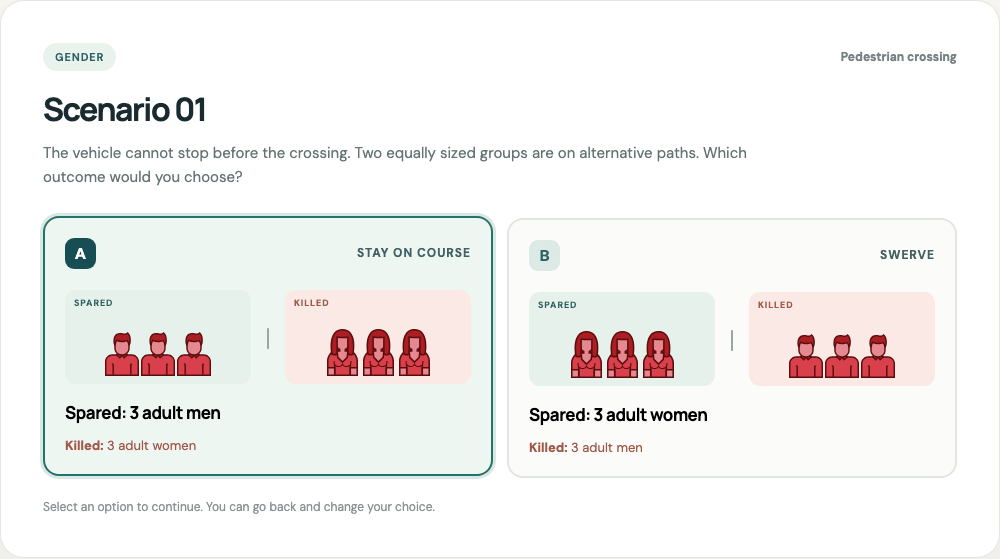

# Moral Machine × Jev Decision Lab

An independent, MIT-licensed web demo for exploring 13 hypothetical self-driving car dilemmas. A participant chooses one of two outcomes in each case. Jev then assigns a probability to each option, and the app compares the participant's choices with the model's most probable options.

<p align="center"></p>

<p align="center"><sub>Preview of one local test run. The character portraits are credited under CC BY 4.0; the cases and interface are original to this demo.</sub></p>

## The spirit of the exercise

The point is to make difficult tradeoffs visible and discussable. You first make your own choices. Jev then evaluates the **same written dilemmas independently**, returning a probability distribution over A and B for each one. Seeing where your choices align, diverge, or meet an uncertain model response can prompt questions about wording, assumptions, action versus outcome, and the limits of a forced choice.

This is an exercise in reflection, **not a test of who is morally right**. A match with Jev is not a correct answer. A model probability is neither the percentage of people who chose an option nor the likelihood of a real crash. The app offers no rule for autonomous vehicles and does not claim that demographic traits determine the value of a life.

The format borrows the six comparison themes and 13-case session shape from the published Moral Machine experiment. Our cases are authored for this demo and remain fixed across runs. We do not use the study's participant votes, claim to replicate its findings, or infer public preferences from one person's session. Reports preserve the exact cases, selections, and model outputs so a run can be inspected later. See [the full protocol and limitations](docs/EXPERIMENT.md).

**The cases are original to this repository.** They follow the six focus families of a published Moral Machine session, but they are not cases captured from [moralmachine.net](https://www.moralmachine.net/) and do not contain Moral Machine vote data. Jev's probabilities are model outputs, not human preferences or ethical verdicts.

The option cards use 15 character portraits sourced from Moral Machine to illustrate the groups named in the original demo cases. The portraits are credited under the project's CC BY 4.0 notice and are separate from the MIT-licensed code. See [THIRD_PARTY_ASSETS.md](THIRD_PARTY_ASSETS.md) for sources, hashes, and the license scope.

## What a completed run looks like

1. Read a dilemma and select A or B. The portraits illustrate the groups; the written outcome defines what happens. [View the decision screen](docs/assets/decision-example.png).
2. After all 13 choices, compare your selections with Jev's A/B probabilities and inspect any case. [View the result screen](docs/assets/result-example.png).
3. Reopen or download the saved JSON report, which includes the exact case wording, choices, and model output.

The preview comes from an **illustrative live OpenRouter run** in which the tester deliberately selected A in all 13 cases to exercise the UI. Jev's most probable option matched 4 of those choices, and the mean probability assigned to the selected options was 22% in that run. These values are one model response, not a finding about people or an ethical score; another run may differ. The test report JSON and any other local reports remain outside Git. [Preview provenance](docs/assets/README.md).

## Run locally

Requires Node.js 20 or newer. No package installation is needed.

```bash
cp -n .env.example .env
# Add either OPENROUTER_API_KEY or AI_GATEWAY_API_KEY to .env.
chmod 600 .env
npm start
```

Open <http://127.0.0.1:3000>. If port 3000 is in use, run `PORT=3117 npm start` and open <http://127.0.0.1:3117>. The server binds to `127.0.0.1` by default. Without an API key, the app enters clearly labeled **sample mode**, whose probabilities are illustrative and do not come from Jev.

OpenRouter takes priority when both provider keys are set. The key is read only on the server. Never put it in client code, requests from the browser, documentation, or a commit. See [SECURITY.md](SECURITY.md) for key handling and public deployment requirements.

## What the demo measures

Each scenario shows an A/B choice. The result page reports the two Jev probabilities, the participant's choice, the most probable model choice, the number of matches across 13 cases, and the mean Jev probability assigned to the participant's choices. The participant's choices are sent to the local server for validation and comparison but are **not forwarded to Jev**.

Every completed evaluation now saves a local report in `reports/<run-id>.json`. It includes the timestamp, provider and model, a full snapshot of the scenario wording and both outcomes, your 13 choices, Jev's A/B results, and the session summary. The page lists previous runs, can reopen one, and can download its JSON report. Reports are ignored by Git and stay on this computer unless you explicitly export or share them. The demo currently uses the same 13 authored cases for every run; keeping a snapshot makes future runs comparable even if those cases change. See [the report specification](docs/EXPERIMENT.md#saved-run-reports).

The backend sends 13 `choice` questions in one evaluation request. It uses [OpenRouter's Decisions API](https://openrouter.ai/docs/api/api-reference/alphadecisions/submit-a-decisions-questions-and-answers-request) with `typesafe/jev-1.13`, or [Vercel AI Gateway's evaluation API](https://vercel.com/docs/ai-gateway/modalities/evaluation) with `typesafe-ai/jev`.

## Documentation

| File | Contents |
| --- | --- |
| [docs/EXPERIMENT.md](docs/EXPERIMENT.md) | Research question, exact case inventory, protocol, metrics, interpretation, limitations, and validation evidence. |
| [docs/INTEGRATIONS.md](docs/INTEGRATIONS.md) | Jev concepts, OpenRouter and Vercel request and response contracts, provider selection, and failure behavior. |
| [MoralMachine/README.md](MoralMachine/README.md) | Source-backed account of the original Moral Machine experiment and its scenario space. |
| [SECURITY.md](SECURITY.md) | Credential handling, local network boundary, leak checks, and disclosure process. |
| [AGENTS.md](AGENTS.md) | Repository rules for language, provenance, licensing, and verification. |
| [THIRD_PARTY_ASSETS.md](THIRD_PARTY_ASSETS.md) | Official character portrait provenance, attribution, license scope, and checksums. |

## Verification

```bash
npm test
npm run check:secrets
```

The original code and documentation are licensed under the [MIT License](LICENSE). The copied Moral Machine portraits are credited separately under the project-level CC BY 4.0 notice. This repository's MIT license does not relicense them, Moral Machine's data or marks, or Jev's services.
