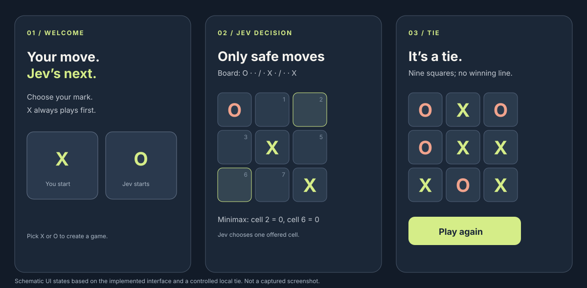
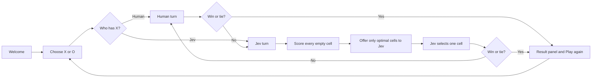

# Visual guide: Tic Tac Toe × Jev

This guide shows the implemented journey and the boundary between game rules and Jev's decision. The illustration is a schematic based on the implemented interface and a controlled local tie; it is not a screenshot.

## Player journey

X always starts. The server owns the board and determines wins or ties after each accepted move. A provider failure keeps the same board and offers Retry Jev's move.

## Matrix and candidate filtering

The board is a flat array of nine cells. A cell's zero-based index is `row * 3 + column`.

| 0 | 1 | 2 |
| --- | --- | --- |
| 3 | 4 | 5 |
| 6 | 7 | 8 |

For the illustrated board `O·· / ·X· / ··X`, it is O's turn. Minimax scores every empty cell from O's perspective: win `+1`, tie `0`, loss `-1`. Cells 2 and 6 preserve a draw against perfect play, so the server sends only `cell_2` and `cell_6` as Jev's `choice` criteria. Jev selects the final square from those criteria. The old unrestricted policy offered every empty cell; in one controlled run Jev chose cell 5, which allowed a forced loss.

## Visible result states

| State | Board | Result panel |
| --- | --- | --- |
| Human win | Winning line highlighted | “You win.” and Play again |
| Jev win | Winning line highlighted | “Jev wins.” and Play again |
| Tie | Full board receives a distinct outline and cell treatment | “It’s a tie.” and Play again |
| Provider error | Board remains unchanged | Error and Retry Jev's move |

New game and Play again both return to mark selection. See [the technical design](../TECHNICAL.md) for the request schema, server routes, log schema, and policy limits.
